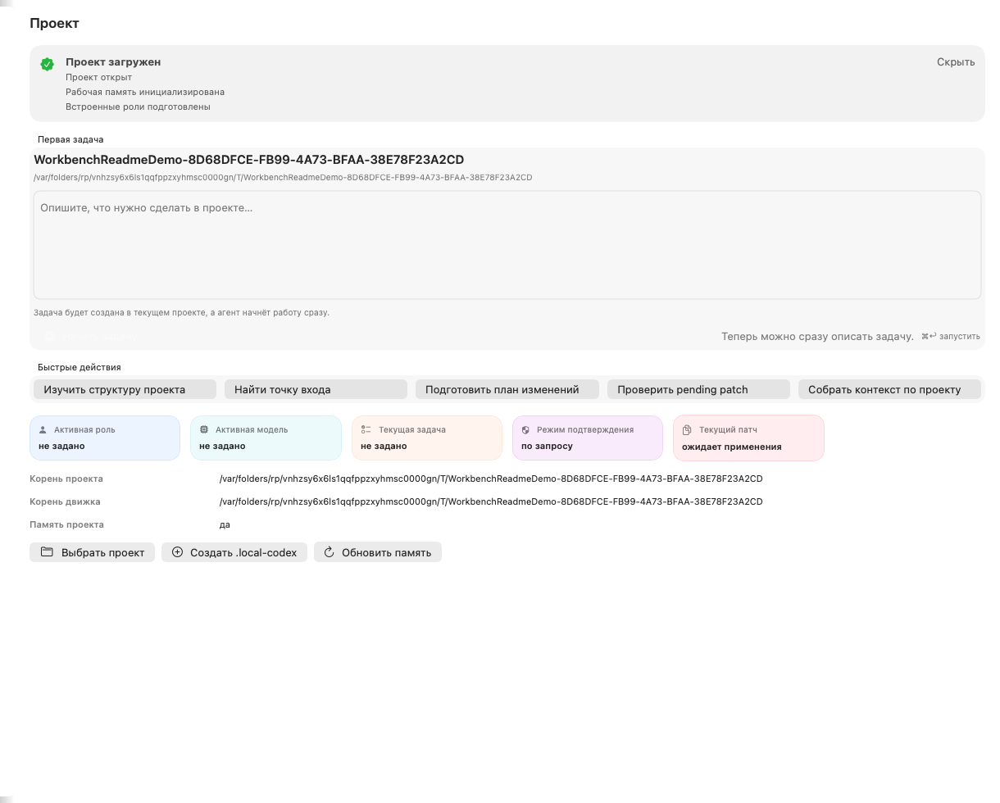
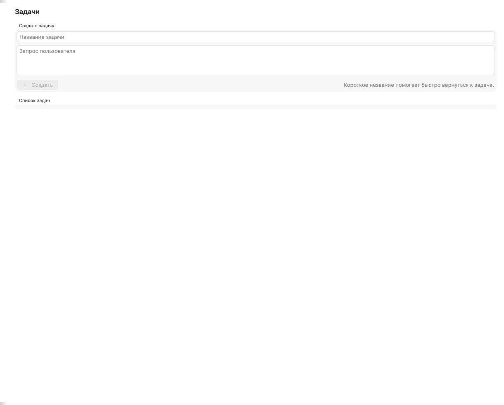
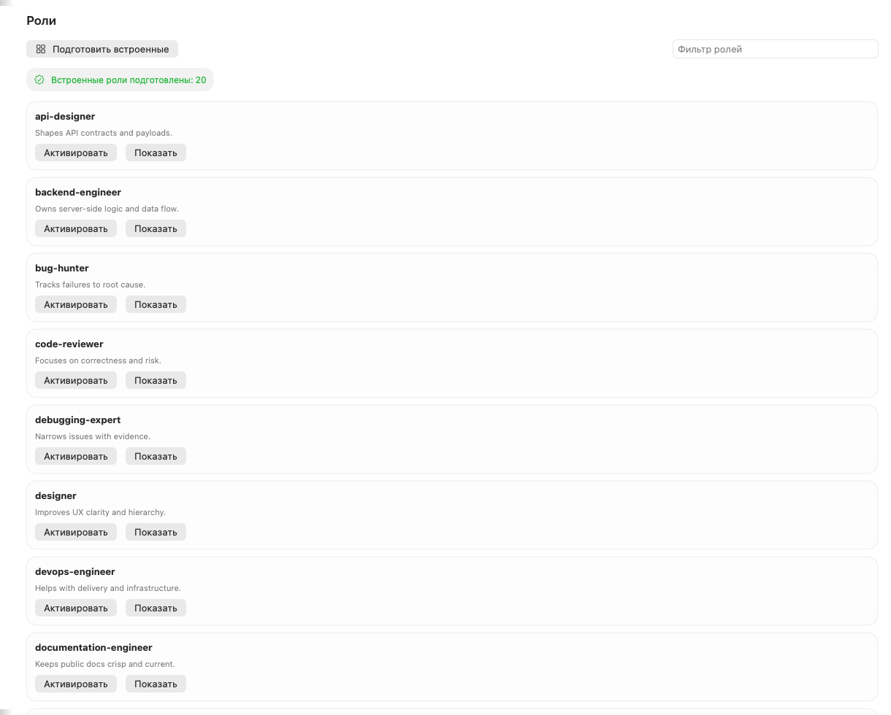
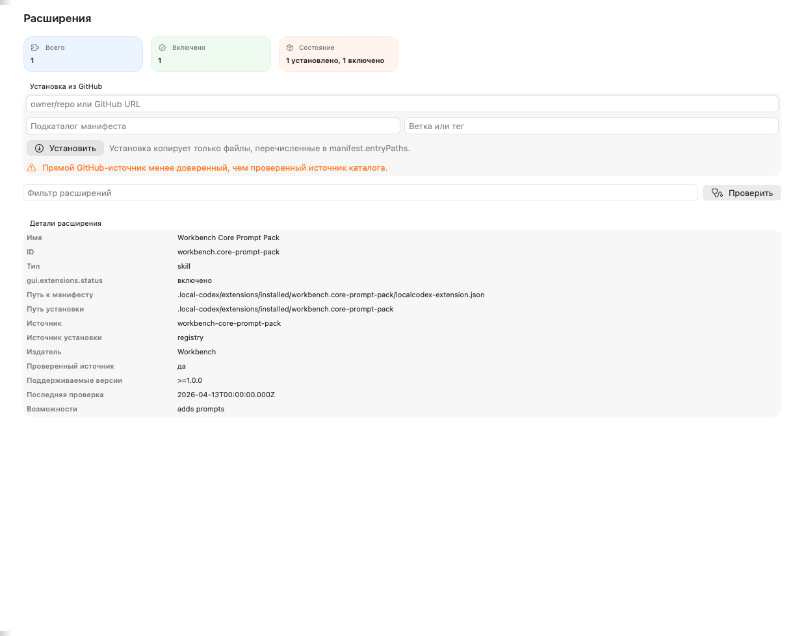
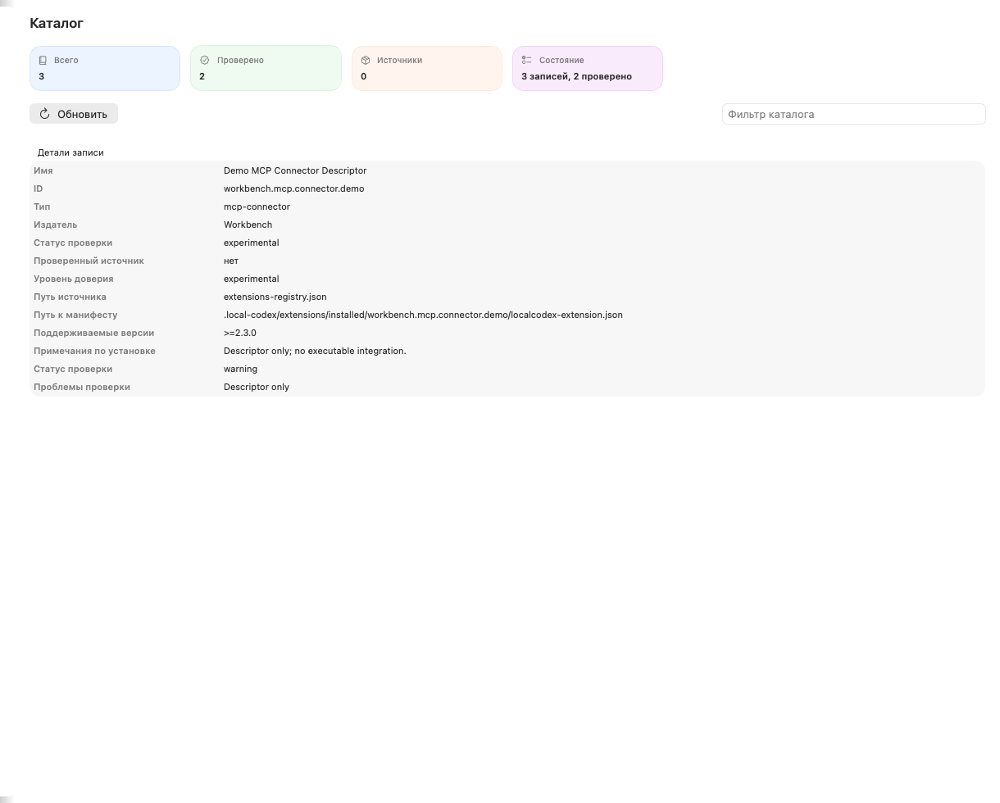
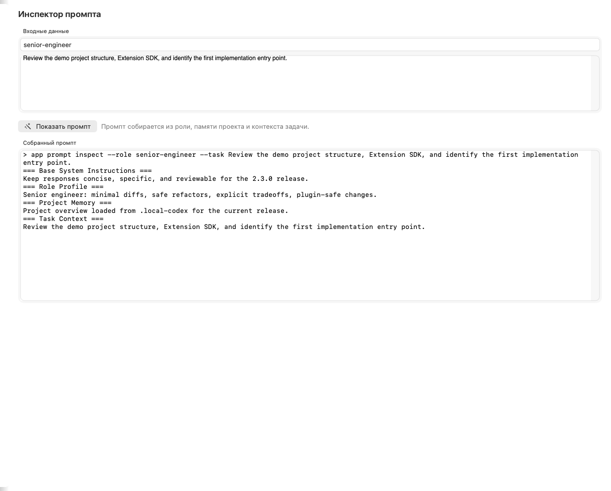
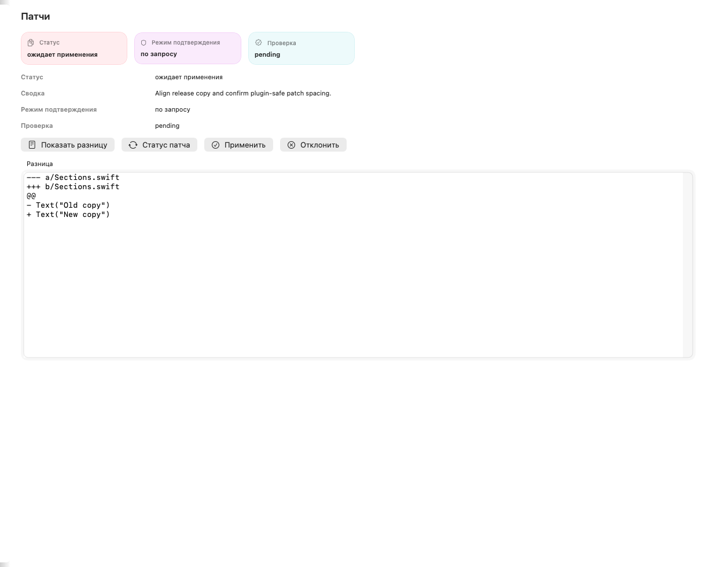
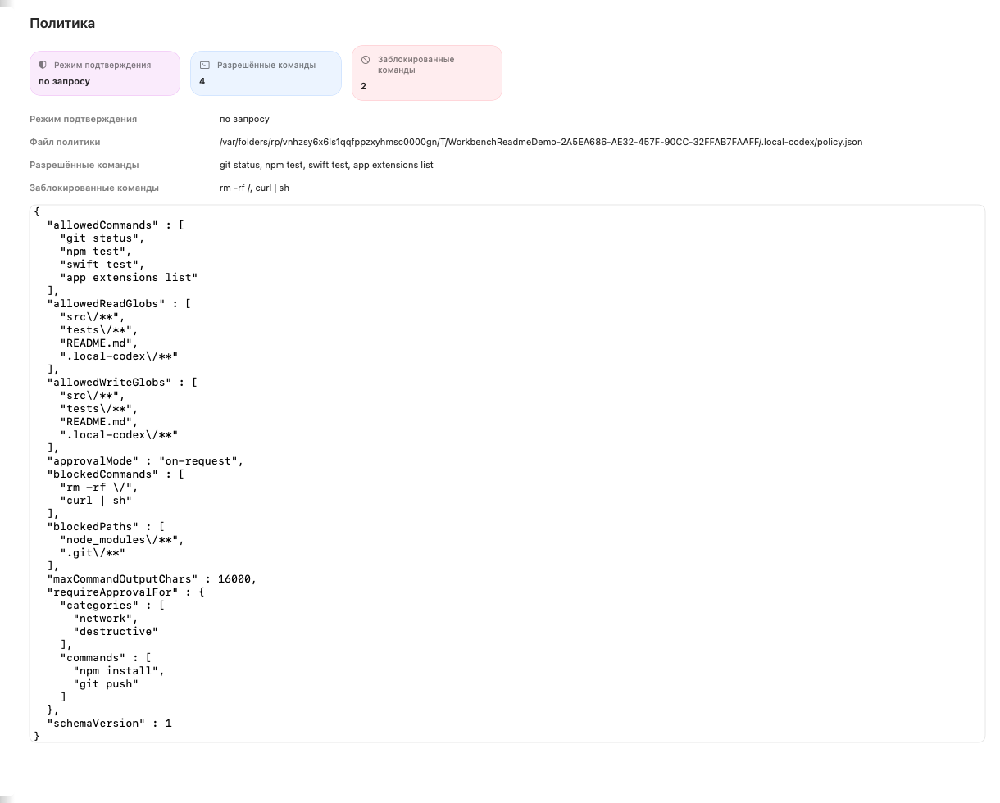
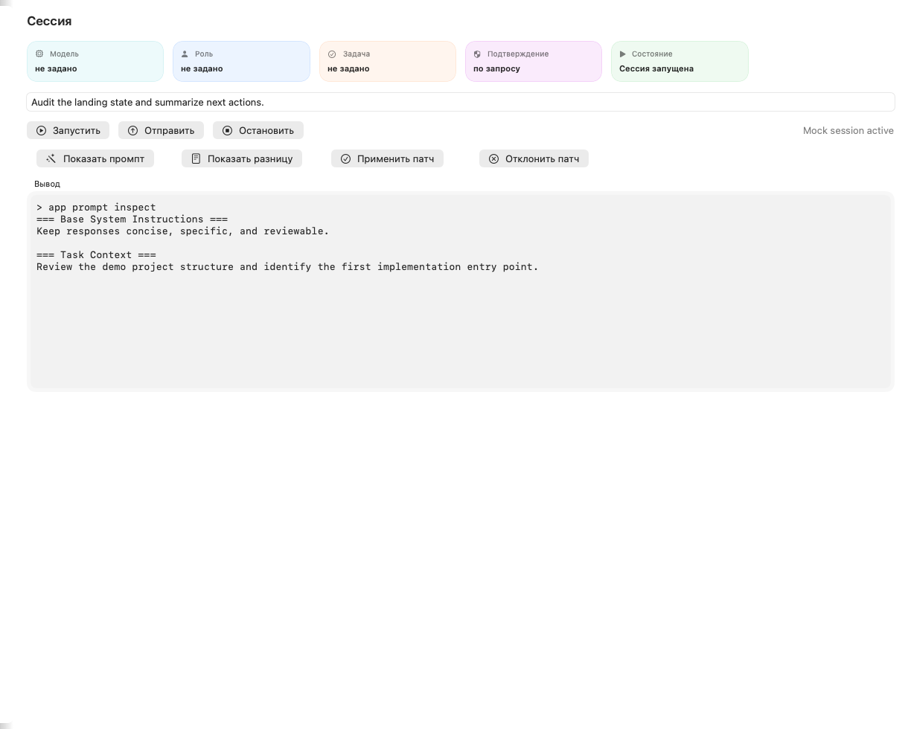
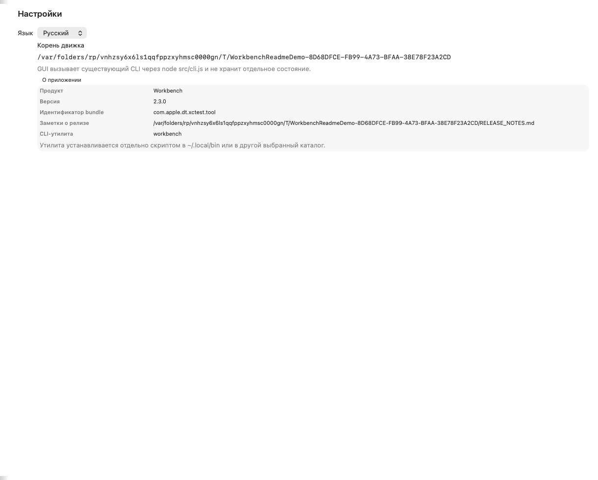

# Workbench


## Contents

- [English](#english)
- [Русский](#russian)
- [Highlights / Возможности](#highlights)
- [Screenshots / Скриншоты](#screenshots)
- [Quick Start / Быстрый старт](#quick-start)
- [Drag & Drop / Перетаскивание папки](#drag-drop)
- [Workspace / Воркспейс](#workspace)
- [Core Commands / Основные команды](#core-commands)
- [`.local-codex/`](#local-codex)
- [GUI](#gui)
- [Release](#release)
- [Notes / Примечания](#notes)

<a id="english"></a>
## English

Workbench is a local coding assistant for macOS powered by Ollama. It combines a terminal-first CLI, a native SwiftUI app, project memory, task tracking, safe patch application, and an inspectable extension system.

Workbench also includes an optional local web dashboard, available from the same project workspace, for quick browser-based inspection of tasks, patches, tests, memory, providers, and roles.

Workbench is now moving toward a provider layer that can switch between Ollama, OpenAI, Anthropic, and Gemini through the same CLI and workspace state.

<a id="russian"></a>
## Русский

Workbench - локальный coding assistant для macOS на базе Ollama. Он сочетает CLI, native SwiftUI app, память проекта, задачи, безопасные патчи и inspectable extension system.

Workbench также включает опциональный локальный web dashboard, который открывается из того же project workspace и позволяет быстро смотреть задачи, патчи, тесты, память, провайдеры и роли в браузере.

Workbench также получает provider layer, который позволяет переключаться между Ollama, OpenAI, Anthropic и Gemini через один и тот же интерфейс.

<a id="highlights"></a>
## Highlights / Возможности

- Local Ollama integration over `http://localhost:11434`
- Multi-provider layer for Ollama, OpenAI, Anthropic, and Gemini
- Russian-first CLI and GUI by default
- Native macOS SwiftUI wrapper over the same filesystem-based engine
- Project memory, role profiles, task workspace, and prompt composition
- Reviewable patch workflow with approval modes and policy-driven execution
- Manifest-driven GitHub extensions with a curated registry layer
- Inspectable on-disk state in `.local-codex/`

- Интеграция с локальным Ollama через `http://localhost:11434`
- Provider layer для Ollama, OpenAI, Anthropic и Gemini
- Русский интерфейс по умолчанию в CLI и GUI
- Native macOS SwiftUI оболочка поверх того же filesystem-based engine
- Память проекта, профили ролей, task workspace и сборка prompt
- Reviewable patch workflow с approval modes и policy-driven execution
- Manifest-driven GitHub extensions и curated registry layer
- Полностью inspectable состояние на диске в `.local-codex/`

<a id="screenshots"></a>
## Screenshots / Скриншоты

Workbench is ready as soon as a project opens. Quick tour below.

Workbench готов сразу после открытия проекта. Короткий тур ниже.

<table>
  <tr>
    <td align="center" width="50%">
      
      <br /><sub>Project ready / Проект</sub>
    </td>
    <td align="center" width="50%">
      
      <br /><sub>Tasks / Задачи</sub>
    </td>
  </tr>
  <tr>
    <td align="center" width="50%">
      
      <br /><sub>Roles / Роли</sub>
    </td>
    <td align="center" width="50%">
      
      <br /><sub>Extensions / Расширения</sub>
    </td>
  </tr>
  <tr>
    <td align="center" width="50%">
      
      <br /><sub>Registry / Каталог</sub>
    </td>
    <td align="center" width="50%">
      
      <br /><sub>Prompt inspector / Промпт</sub>
    </td>
  </tr>
  <tr>
    <td align="center" width="50%">
      
      <br /><sub>Patches / Патчи</sub>
    </td>
    <td align="center" width="50%">
      
      <br /><sub>Policy / Политика</sub>
    </td>
  </tr>
  <tr>
    <td align="center" width="50%">
      
      <br /><sub>Session / Сессия</sub>
    </td>
    <td align="center" width="50%">
      
      <br /><sub>Settings / Настройки</sub>
    </td>
  </tr>
</table>

<a id="quick-start"></a>
## Quick Start / Быстрый старт

### Requirements / Требования

- Node.js 20+
- Ollama running locally
- A downloaded model, for example `qwen2.5-coder:14b`

- Node.js 20+
- Запущенный Ollama
- Загруженная модель, например `qwen2.5-coder:14b`

### Install / Установка

```bash
./scripts/install-macos.sh
```

This installs the CLI package locally and exposes `app` and `workbench`.

Это устанавливает CLI-пакет локально и делает доступными команды `app` и `workbench`.

Optional CLI helper:

```bash
./scripts/install_cli_helper.sh
```

Опциональный CLI helper:

```bash
./scripts/install_cli_helper.sh
```

This installs `workbench`, a folder-first launcher:

```bash
workbench ~/path/to/project
workbench ~/path/to/project "Implement auth flow"
workbench
```

After a project opens, the first screen shows a task composer so you can start immediately.

Это устанавливает `workbench` - запускатель, который первым делом открывает папку проекта:

```bash
workbench ~/path/to/project
workbench ~/path/to/project "Implement auth flow"
workbench
```

После открытия проекта первый экран показывает composer задачи, чтобы можно было сразу начать работу.

<a id="workspace"></a>
## Workspace / Воркспейс

Workbench keeps a global workspace registry in `~/.workbench/`, so you can switch between projects without retyping full paths every time.

Workbench хранит глобальный реестр проектов в `~/.workbench/`, чтобы можно было быстро переключаться между проектами без повторного ввода пути.

```bash
workbench add ~/projects/tasuj --alias tasuj
workbench list
workbench switch tasuj
workbench status tasuj
```

```bash
app workspace list
app workspace switch tasuj
app workspace refresh
```

### Run / Запуск

Start the interactive agent:

```bash
app start /path/to/project
```

Start with a specific model:

```bash
app start /path/to/project --model qwen2.5-coder:14b
```

Start with a specific provider:

```bash
app start /path/to/project --provider openai --model gpt-4o
```

Start with a specific role:

```bash
app start /path/to/project --role software-architect
```

Start and immediately queue the first task:

```bash
app start /path/to/project --task "Implement auth flow"
```

Запустить интерактивного агента:

```bash
app start /path/to/project
```

Выбрать модель:

```bash
app start /path/to/project --model qwen2.5-coder:14b
```

Выбрать провайдер:

```bash
app start /path/to/project --provider openai --model gpt-4o
```

Выбрать роль:

```bash
app start /path/to/project --role software-architect
```

<a id="drag-drop"></a>
### Drag & Drop / Перетаскивание папки

- Drag a folder onto `Workbench.app` or the mounted DMG to open it as the active project.
- The app auto-initializes `.local-codex/` and prepares built-in roles on first open.

- Перетащите папку на `Workbench.app` или смонтированный DMG, чтобы открыть её как активный проект.
- Приложение автоматически создаёт `.local-codex/` и готовит встроенные роли при первом открытии.

The same folder-first flow is available in Terminal:

```bash
workbench ~/path/to/project
workbench ~/path/to/project "Implement auth flow"
```

Такой же сценарий доступен в Терминале:

```bash
workbench ~/path/to/project
workbench ~/path/to/project "Implement auth flow"
```

### Native macOS App / Native macOS app

Build and run the GUI:

```bash
./scripts/build_and_run_macos.sh
```

Manual GUI loop:

```bash
cd macos/LocalCodexMac
swift test
swift build
swift run LocalCodexMac
```

GUI build-and-run:

```bash
./scripts/build_and_run_macos.sh
```

Ручной цикл GUI:

```bash
cd macos/LocalCodexMac
swift test
swift build
swift run LocalCodexMac
```

If the app cannot locate the engine automatically:

```bash
export LOCAL_CODEX_ENGINE_ROOT="/Volumes/Inside 1/ЛОКАЛКА"
```

Если приложение не находит engine автоматически:

```bash
export LOCAL_CODEX_ENGINE_ROOT="/Volumes/Inside 1/ЛОКАЛКА"
```

<a id="core-commands"></a>
## Core Commands / Основные команды

### Project memory / Память проекта

```bash
app project init
app project status
app project refresh
app project summary
app memory show project_overview
app memory rebuild
```

### Providers / Провайдеры

```bash
app provider list
app provider use ollama
app provider set-key openai sk-proj-...
app provider health
app model list
```

### Roles / Роли

```bash
app roles list
app roles show code-reviewer
app roles create infra-consultant
app roles scaffold
app roles use software-architect
app roles current
```

Built-in role profiles now include 20 ready-to-use roles: `frontend-engineer`, `backend-engineer`, `test-engineer`, `performance-optimizer`, `refactoring-strategist`, `release-engineer`, `api-designer`, `migration-engineer`, `qa-analyst`, `bug-hunter`, `devops-engineer`, `security-reviewer`, `documentation-engineer`, `integration-engineer`, plus the core roles for architecture, review, debugging, design, and product thinking.

Встроенные профили ролей теперь включают 20 готовых ролей: `frontend-engineer`, `backend-engineer`, `test-engineer`, `performance-optimizer`, `refactoring-strategist`, `release-engineer`, `api-designer`, `migration-engineer`, `qa-analyst`, `bug-hunter`, `devops-engineer`, `security-reviewer`, `documentation-engineer`, `integration-engineer`, а также базовые роли для архитектуры, ревью, отладки, дизайна и продуктового мышления.

For convenience, the built-in set is grouped like this:

- Core thinking: `senior-engineer`, `software-architect`, `code-reviewer`, `debugging-expert`, `designer`, `product-manager`
- Delivery and implementation: `frontend-engineer`, `backend-engineer`, `devops-engineer`, `integration-engineer`, `release-engineer`
- Quality and stability: `test-engineer`, `performance-optimizer`, `refactoring-strategist`, `qa-analyst`, `bug-hunter`, `security-reviewer`
- Product and communication: `api-designer`, `migration-engineer`, `documentation-engineer`

Для удобства встроенный набор сгруппирован так:

- Базовое мышление: `senior-engineer`, `software-architect`, `code-reviewer`, `debugging-expert`, `designer`, `product-manager`
- Разработка и поставка: `frontend-engineer`, `backend-engineer`, `devops-engineer`, `integration-engineer`, `release-engineer`
- Качество и стабильность: `test-engineer`, `performance-optimizer`, `refactoring-strategist`, `qa-analyst`, `bug-hunter`, `security-reviewer`
- Продукт и коммуникация: `api-designer`, `migration-engineer`, `documentation-engineer`

### Tasks / Задачи

```bash
app task create --title "Auth refactor" --request "Переработать вход пользователя"
app task list
app task show task-2026-04-13-auth-refactor
app task use task-2026-04-13-auth-refactor
app task plan task-2026-04-13-auth-refactor
app task note task-2026-04-13-auth-refactor --kind finding --text "Нашел узкое место в валидации."
app task history task-2026-04-13-auth-refactor
app task sessions task-2026-04-13-auth-refactor
app task export task-2026-04-13-auth-refactor --format md
app task continue task-2026-04-13-auth-refactor
app task auto task-2026-04-13-auth-refactor --request "Добавь JWT auth" --dry-run
app task run-status task-2026-04-13-auth-refactor
app task abort task-2026-04-13-auth-refactor
app task runs task-2026-04-13-auth-refactor
app task done task-2026-04-13-auth-refactor
app task archive task-2026-04-13-auth-refactor
app task current
```

Auto mode turns a task into a plan/execute/report loop: it proposes a short plan first, then can continue through patch application and validation.

Авто-режим превращает задачу в цикл plan/execute/report: сначала предлагает короткий план, затем может продолжить с применением патчей и проверкой.

### Prompt / Промпт

```bash
app prompt inspect --role code-reviewer --task "Review the auth flow"
```

### Patches / Патчи

```bash
app diff
app patch status
app patch apply
app patch reject
```

### Stats / Статистика

```bash
app stats
app stats --section tests
app stats refresh
app stats prune --keep-days 90
app stats export --format csv
```

### Extensions and registry / Расширения и каталог

```bash
app extensions install owner/repo --path packs/roles --yes
app extensions list
app extensions doctor
app registry add-source ./extensions-registry.json
app registry refresh
app registry list
app registry install sample.reviewed
```

### Web dashboard / Локальный дашборд

```bash
app server start --open
app server status
app server stop
```

The optional local dashboard mirrors the same project state in a browser and stays offline-first.

Опциональный локальный дашборд показывает тот же проектный state в браузере и работает offline-first.

### Provider workspace / Рабочая область провайдеров

Provider settings live in `.local-codex/providers.json` and are created automatically when you initialize or open a project. The file stays local and is ignored by Git.

Настройки провайдеров хранятся в `.local-codex/providers.json` и создаются автоматически при инициализации или открытии проекта. Файл остается локальным и игнорируется Git.

<a id="local-codex"></a>
## `.local-codex/`

Project memory lives inside `.local-codex/` in the selected repository. It stays fully inspectable and editable on disk.

### Structure

- `project_overview.md` - project summary plus manual notes
- `architecture_notes.md` - architecture observations plus manual notes
- `decisions_log.md` - decision history and manual notes
- `policy.json` - safe execution policy, approval modes, allow/deny rules
- `pending-change.json` - last pending patch or its final status
- `patches/` - patch archives and diff artifacts
- `module_summaries/` - summaries for important source roots and files
- `prompts/` - reusable prompts and role profiles
- `prompts/roles/` - built-in and custom roles in Markdown
- `tasks/` - task index, active work, archive, and templates
- `state.json` - project state: schema version, timestamps, active role, selected model, current task, project root
- `extensions/` - inspectable workspace for GitHub-installed extensions
- `extensions/registry.json` - installed extension catalog and activation state
- `extensions/cache/` - cached manifests and files
- `extensions/installed/` - installed extension files

### Memory workflow

- `app project init` creates the `.local-codex/` structure
- `app project refresh` scans the repo and updates generated summaries
- `app memory rebuild` runs the same regeneration cycle
- `app project status` shows memory state, current role, model, task, and approval mode
- Manual notes stay separated from generated content with explicit markers:
  - `<!-- GENERATED START -->`
  - `<!-- GENERATED END -->`
  - `<!-- MANUAL NOTES START -->`
  - `<!-- MANUAL NOTES END -->`

<a id="gui"></a>
## GUI

The macOS GUI lives in `macos/LocalCodexMac/` and wraps the same filesystem-based engine used by the CLI.

What the GUI does:

- opens a project folder through the native file picker
- reads the same `.local-codex/` files as the CLI
- shows project, tasks, roles, prompt inspector, patches, policy, session, extensions, and registry views
- runs the existing CLI engine through `node src/cli.js`
- writes the engine root into the app bundle during the macOS build so Finder launches can still resolve the local CLI engine
- does not keep a separate hidden source of truth

Source of truth on disk:

- `.local-codex/state.json`
- `.local-codex/tasks/`
- `.local-codex/prompts/roles/`
- `.local-codex/pending-change.json`
- `.local-codex/patches/`
- `.local-codex/policy.json`

GUI localization:

- `ru` - default language
- `en` - fallback English pack

UI labels, buttons, menus, statuses, and errors go through localization and default to Russian-first UX.

Supported GUI flows:

- choose a project folder
- initialize `.local-codex`
- refresh project status
- inspect tasks and roles
- manage extensions and registry entries
- inspect the composed prompt
- inspect pending patches and apply/reject them
- run the session console on top of the CLI engine
- change language in Settings

<a id="release"></a>
## Release

Release preparation scripts live in `scripts/`:

- `scripts/build_macos_app.sh`
- `scripts/run_macos_app.sh`
- `scripts/package_macos_dmg.sh`
- `scripts/sign_macos_app.sh`
- `scripts/notarize_macos_app.sh`
- `scripts/staple_macos_app.sh`
- `scripts/validate_notarized_app.sh`
- `scripts/install_cli_helper.sh`
- `scripts/release_candidate_smoke.sh`

Release docs:

- `CHANGELOG.md`
- `docs/release-checklist.md`
- `docs/gui-smoke-checklist.md`
- `docs/manual-qa-template.md`
- `docs/release-notes-template.md`
- `docs/release-notes-1.0.0.md`
- `docs/release-notes-1.1.0.md`
- `docs/release-notes-1.2.0.md`
- `docs/release-notes-1.3.0.md`

Signing and notarization are intentionally environment-driven. Credentials are expected from environment variables or a local secure setup, not from the repository.

<a id="notes"></a>
## Notes / Примечания

- Internal identifiers such as `app`, `LocalCodexMac`, and `.local-codex/` remain unchanged for compatibility.
- Public product branding is `Workbench`.
- The current release line is `1.3.0`.
